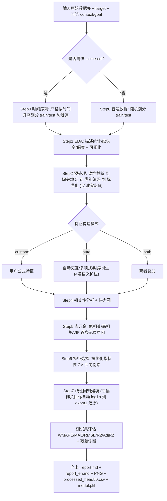

# auto-feature-regression

> 面向**回归预测任务**的自动化特征工程 + 线性回归建模工具。给定业务背景和分析目标，输入一份原始数据集，自动产出覆盖预处理 / 特征工程 / 建模 / 评估全流程的**中英双语报告** + 可视化图表 + 可复用模型。

只需提供数据集和目标列，工具会自动完成数据划分、EDA、预处理、特征构造、去冗余、特征选择、线性回归建模与评估，并生成带图解的分析报告。

---

## ✨ 特性

- **一键式流程**：从原始数据到分析报告、图表和模型文件，7 步全自动。
- **防数据泄漏优先**:所有预处理参数（填充值、截断分位、编码、标准化)只在训练集上 fit;时间序列严格按时间切分，绝不打乱。
- **可解释性**:输出系数可读、带 p 值 / 置信区间的线性模型作为 baseline，而非黑盒。
- **智能特征工程**:自动构造交互 / 多项式 / 时序衍生特征，并经四道语义护栏过滤无意义、共线、无增益的组合。
- **中英双语报告**:`report.md` 与 `report_en.md` 结构一致、共用图表与数值。
- **数据驱动图解**:每张图都结合业务背景与真实统计量给出解读。

---

## 📌 适用场景

| 典型场景 | 说明 |
|---|---|
| **业务指标预测** | 预测日营收、订单量、GMV、成本、转化率等连续数值目标，并识别关键驱动因子 |
| **时间序列回归** | 含日期列的经营数据，需严格按时间划分训练 / 测试集、防止未来信息泄漏 |
| **快速可解释基线** | 需要系数可读、带 p 值 / 置信区间的线性模型作为 baseline，而非黑盒模型 |
| **特征工程探索** | 想快速试验交互项 / 多项式 / 时序衍生特征，并自动过滤无意义、共线、无增益的特征 |
| **分析报告产出** | 需要一份含描述统计、相关性热力图、冗余特征说明、模型公式与指标的报告 |

### ⚠️ 局限性

- 只能拟合**线性回归**模型，最终入模特征都要求是数值型特征。
- 不适用于分类任务（目标为类别）、纯时序预测的深度模型、非结构化数据（图像 / 文本 / 音频）。

---

## 🚀 快速开始

### 环境依赖

首次使用需安装依赖:

```bash
pip install --user --break-system-packages pandas numpy scikit-learn matplotlib seaborn statsmodels tabulate
```

### 时间序列数据（必须传 `--time-col`)

```bash
python3 scripts/auto_feature_regression.py \
    --data ~/files/sales.csv --target quarter_revenue \
    --time-col period_start_date --exclude account_id,account_name \
    --context "广告季度收入数据" --goal "预测季度广告收入并找驱动因子" \
    --optimize-metric WMAPE --outdir ./output
```

### 普通截面数据（不传 `--time-col` → 随机划分)

```bash
python3 scripts/auto_feature_regression.py --data data.csv --target y --outdir ./output
```

---

## ⚙️ 参数说明

### 必填参数

| 参数 | 说明 |
|---|---|
| `--data` | 数据集文件，CSV / Excel，含 1 个数值型目标列 + 若干特征列 |
| `--target` | 要预测的数值目标列名 |

### 关键可选参数

| 参数 | 何时用 | 示例 |
|---|---|---|
| `--time-col` | 数据集为时间序列时**必传**，否则退化为随机划分导致评估失真 | `--time-col date` |
| `--exclude` | 排除 ID / 名称等非特征列，或易泄漏的 target 衍生列 | `--exclude id,shop_name` |
| `--context` | 一句话业务背景，写入报告并让图解更贴切 | `--context "广告季度收入数据"` |
| `--goal` | 一句话建模目标，让图解围绕目标展开 | `--goal "预测季度广告收入并找驱动因子"` |
| `--optimize-metric` | 指定优化指标，驱动特征选择方向 | `WMAPE`(默认) / `MAE` / `RMSE` / `R2` / `Adj_R2` |
| `--feature-mode` | 特征构造模式 | `auto`(默认) / `custom` / `both` |
| `--custom-features` | 自定义业务特征公式 | `"revenue_intensity = revenue_L30 / 30"` |
| `--interaction-pairs` | 已知哪些特征相乘有业务含义时精确指定（跳过自动组合与护栏） | `"price*volume; ad_cost*ctr"` |
| `--impute` / `--impute-overrides` | 缺失值填充策略（全局 / 按列） | `--impute-overrides "recharge:zero"` |
| `--log-target` | 严重右偏目标的 log1p 变换开关 | `auto`(默认) / `on` / `off` |
| `--outdir` | 输出目录 | `--outdir ./output` |

---

## 🔄 工作流



### 7 步详解

| Step | 内容 |
|---|---|
| **Step 0 数据划分** | 提供 `--time-col` → 严格按时间升序切分（不打乱），防止未来信息泄漏；否则随机划分 |
| **Step 1 EDA** | 均值 / 方差 / 极值 / 偏度 / 缺失率 + 目标分布图或时序图 |
| **Step 2 预处理** | 离群分位截断（1% / 99%）→ **不因高缺失率删列**，按每列分布建议填充策略（中位数 / 均值 / 众数 / 填 0）→ One-Hot → 标准化。所有 fit 参数只取自训练集 |
| **Step 3 特征构造** | `auto` 自动造交互 / 多项式 / 时序衍生（交互项经四道护栏）；`custom` 用户业务公式；`both` 叠加。所有构造特征均登记，被跳过的组合逐条记录原因 |
| **Step 4 相关性分析** | 相关性热力图 + 特征-目标相关性条形图 |
| **Step 5 去冗余** | 与 target 低相关 / 特征间高相关 / VIF 多重共线性，逐条记录删除原因 |
| **Step 6 特征选择** | 以 `--optimize-metric` 为准，在训练集上做交叉验证后向剔除（时序 TimeSeriesSplit，普通 KFold，均 4 折） |
| **Step 7 建模评估** | 线性回归 + 测试集指标 + 残差诊断；严重右偏非负目标自动 log1p、预测后 expm1 还原，指标在原始尺度计算 |

> **防数据泄漏是第一原则**:所有预处理参数(填充值、截断分位、编码、标准化)只在训练集上 fit，再应用到测试集；时间序列严格按时间切分，绝不打乱。

---

## 📂 输出产物（位于 `--outdir`)

| 文件 | 内容 |
|---|---|
| `report.md` | 分析背景目标、预处理汇总、描述统计、相关性、去冗余原因、构造特征清单、最终特征、模型公式 + 系数表（含 p 值 / 置信区间）、评价指标、数据划分说明；每张图配数据驱动的「图解」 |
| `report_en.md` | 上述报告的英文版，结构完全一致（叙述与表头翻译，图表 / 公式 / 数值共用） |
| `01_missing_rate.png` 等 PNG | 缺失率、目标分布 / 时序、相关性热力图、特征-目标相关性条形图、残差诊断图；标题 / 坐标 / 单位均标注，大数值自动 K/M/B 格式化，无中文字体自动降级英文 |
| `processed_head50.csv` | 预处理后数据前 50 行，便于核对 |
| `model.pkl` | 拟合好的模型 + scaler + 特征列表 + 预处理参数，供后续复用 / 预测 |

---

## 🧠 核心机制

### 目标 log 变换（`--log-target`)

判定逻辑（auto 模式）:

- `--log-target on` → 强制 log1p
- `--log-target off` → 强制不变换
- `--log-target auto`(默认) → 当**目标偏度 > 1.0 且目标最小值 ≥ 0** 时,做 log1p 变换、预测后 expm1 还原,所有指标在原始尺度计算;否则不变换

对收入、GMV、成本等严重右偏且非负的目标取对数后,分布更接近正态、更契合线性回归的等方差假设。含负值时自动关闭以保证鲁棒性。

### 交互项特征的四道护栏（`auto` 模式)

| 规则 | 阈值 | 说明 |
|---|---|---|
| ① 同族过滤 | `INTER_SKIP_SAME_FAMILY=True` | 按列名词根识别「同一指标的不同期 / 分片」（如 `revenue_q1` 与 `revenue_q2`），默认不相乘。`--allow-same-family` 可放开 |
| ② 高共线过滤 | `INTER_SKIP_HIGH_CORR=0.8` | 特征相关系数 > 0.8 时不相乘，避免加剧共线性 |
| ③ 增益校验 | `INTER_MIN_GAIN=0.02` | 交互项与 target 的 \|corr\| 须比两母特征各自 \|corr\| 至少高 0.02，否则丢弃 |
| ④ 数量上限 | `INTER_MAX_KEEP=8` | 按增益排序只保留 Top-8，防维度爆炸 |

> 使用 `--interaction-pairs "price*volume; ad_cost*ctr"` 可精确指定组合，**跳过全部自动组合与护栏**，只造用户列出的对。

### 缺失值处理

- **不再因高缺失率删列**:缺失率超过 `HIGH_MISS_HINT(=0.5)` 仅作提示，保留由人工判断信息价值。
- `--impute auto` 基于每列分布特征（偏度、非负性、0 占比、基数）自动建议策略;可用 `--impute` 全局指定或 `--impute-overrides` 按列覆盖。

### 去冗余与特征选择规则

- **低相关剔除**:与 target 的 \|r\| < `CORR_TARGET_MIN(=0.03)` 的候选剔除。
- **高相关剔除**:两特征 \|r\| > `CORR_HIGH(=0.9)`,保留与 target 更相关者。
- **VIF 剔除**:迭代删除 VIF > `VIF_THRESH(=10.0)` 的特征。
- **CV 后向剔除**:以 `--optimize-metric` 为准逐一尝试移除特征,若能改善交叉验证指标则移除,直至无法改善。

---

## 📊 涉及的统计学知识

> 帮助非统计背景读者理解报告中每个指标与判定。

### 线性回归假设 LINE

- **L**inear（线性）:因变量与自变量之间满足线性关系
- **I**ndependent（独立性）:自变量之间、残差之间、残差与自变量之间相互独立
- **N**ormality（正态性）:残差分布服从正态分布
- **E**qual Variance（方差齐性）:残差方差为常数

### 关键概念

- **偏度（Skewness）**:衡量分布相对正态的不对称程度。> 0 右偏,< 0 左偏,≈ 0 近似对称。严重右偏时自动 log1p 变换。
- **皮尔逊相关系数 r**:衡量两变量线性相关强度,取值 [-1, 1]。只捕捉线性关系,非线性强相关也可能 r ≈ 0。
- **多重共线性与 VIF**:$\text{VIF}_i = 1/(1 - R_i^2)$。VIF > 5 需警惕,> 10 判定严重共线（本工具阈值 10.0）。
- **交叉验证（CV）**:普通数据用 4 折 KFold(打乱);时序数据用 4 折 TimeSeriesSplit(不打乱,防泄漏）。

### 评价指标选型

| 优化目标 | 适合的业务场景 |
|---|---|
| **WMAPE**(默认) | 金额 / 销量 / GMV 等量级差异大、按体量看整体偏差;抗零值、便于跨业务比较 |
| **MAE** | 误差需与业务单位一一对应、不想被极端值主导;对偶发异常更宽容 |
| **RMSE** | 大误差代价特别高、须重点压制离群预测（如库存 / 产能 / 电力负荷） |
| **R² / 调整后 R²** | 更关心模型整体解释力与特征贡献;比较不同特征数量的模型优先用调整后 R² |

- **回归系数 / p 值 / 置信区间**:报告系数表同时给出三者。p < 0.05 通常视为统计显著;置信区间跨越 0 则效应方向不确定。
- **残差诊断图**:理想残差应随机分布在 0 附近、无结构、方差恒定、近似正态。漏斗形 = 异方差;U 形 = 未捕捉非线性;系统性偏移 = 模型有偏。

---

## 🗺️ 未来优化方向

1. **模型族扩展**:加入 Ridge / Lasso / ElasticNet 及可解释树模型（如带 SHAP 的 LightGBM)作为可选 baseline。
2. **分类 / 计数任务支持**:扩展到逻辑回归、泊松 / 负二项回归。
3. **更丰富的特征构造**:分箱 / 目标编码、周期性时间特征、多阶交互、业务词典语义分组。
4. **超参与阈值自动调优**:截断分位、VIF / 相关性阈值、交互增益门槛做成可网格 / 贝叶斯搜索的对象。
5. **数据质量与漂移检测**:训练 / 测试分布漂移检测(PSI / KS)、异常样本标记、目标泄漏自动检测。
6. **交叉验证与稳健性增强**:分组 CV、嵌套 CV、时间滚动预测评估;输出预测区间。
7. **交互式与可复用产物**:可交互 HTML 报告、一键预测脚本、REST 化预测接口模板。

---

## 📄 License

请根据实际项目补充许可证信息。
